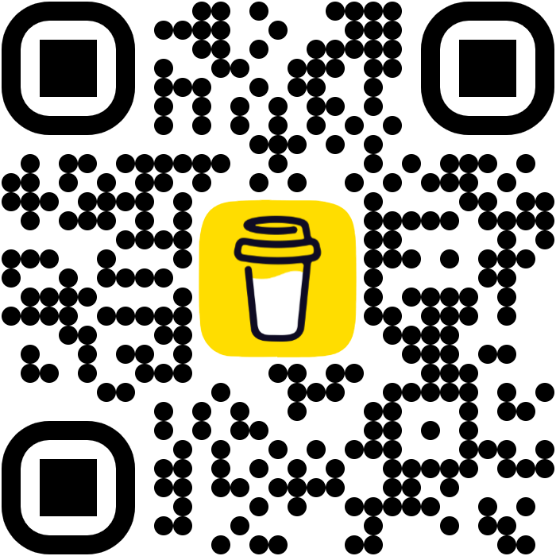

# AirReceive

AirReceive is an Android app for cross-device photo transfer—similar to Apple’s AirDrop. It can **receive** photos on Android (from iPhone browsers or other devices) and **send** photos from Android to an iPhone via the public gateway.

This repo contains two parts that work together:

| Component | Role |
|-----------|------|
| **Android app** (`app/`) | Runs on your phone, receives images, keeps an in-app gallery, and can save to the device photo library. |
| **Public gateway** (`server.js`) | Node.js relay: browser ↔ Android (both directions) over WebSockets and temporary file storage. |

## Thank you for supporting Maverick!
You can donate a buck to support Maverick in continue updating this repo!



## How it works

### Local Wi‑Fi mode (default)

When your phone and the sender are on the same Wi‑Fi network, the app starts a small HTTP server on port `8080`. The sender opens a URL (shown in the app as a QR code or link) in a browser, picks photos, and uploads them directly to the phone. No cloud service is required.

### Public gateway mode (optional)

For senders who are **not** on the same network, deploy the included gateway server (e.g. on [Render](https://render.com)). The gateway:

1. Serves a web UI where anyone can drag-and-drop or select an image.
2. Accepts uploads via `POST /upload` and stores them temporarily.
3. Notifies the Android app over a WebSocket (`/ws/phone`).
4. Lets the app download the file via `GET /download/:id`, then deletes it from the server.

In the app, open the **Settings** tab and choose:

- **Free AirReceive gateway** — uses `https://airreceive-repo.onrender.com` (no paste required), or
- **My own cloud portal** — paste your Render URL (for example `https://your-app.onrender.com`) and tap the checkmark.

The status badge on the gateway home page turns green when your Android phone is connected.

### Android app tabs

The app uses a bottom navigation bar:

| Tab | Purpose |
|-----|---------|
| **Home** | Start/stop receiver, local Wi‑Fi QR link, active transfers |
| **Send** | Pick an online receiver and send photos or files (gateway mode) |
| **Gallery** | View, share, and save received photos |
| **Settings** | Free hosted gateway, custom Render URL, or local Wi‑Fi only |

### Gateway URLs

| URL | Purpose |
|-----|---------|
| `https://your-app.onrender.com/` | **Hub** — choose Send to Android, Send to device, or Receive |
| `https://your-app.onrender.com/to-android` | Send a photo **to Android** from any browser |
| `https://your-app.onrender.com/send` | Send files **to a chosen PC or phone** (device picker) |
| `https://your-app.onrender.com/receive` | **Receive** files (keep the tab open; set a device name when prompted) |

Uploads use `POST /upload` or `POST /upload/batch` with form field `target`: `phone` (to Android) or `receiver` (to `/receive`). Optional `targetDeviceId` sends only to one registered device (see `GET /api/devices`).

### Send from Android to iPhone or PC (gateway, batch)

1. On Android, enable the gateway in the **Settings** tab (free hosted preset or your own URL).
2. On the receiver device, open **`{gateway}/receive`**, enter a **device name** when prompted, and leave the tab in the foreground until status shows **Ready to Receive**.
3. On Android, tap **Refresh** under **Send to**, select the target device, then **Select photos or files** (or **Photo gallery**).
4. When files appear on the receive page:
   - **Images on iPhone:** tap **Save all to Photos** and confirm on the Share sheet.
   - **PC or mixed files:** tap **Download all files** (non-images show as file rows with individual download links).

### Send from PC to PC or phone (browser)

1. **Receiver:** open **`{gateway}/receive`** on Laptop B (name it e.g. “Laptop-B”).
2. **Sender:** open **`{gateway}/send`** on Laptop A, wait for **Laptop-B** in the device list, select it, choose files, and tap **Send**.
3. Only the selected device receives the batch (not other open `/receive` tabs).

Android uploads via `POST /upload/batch` with `target=receiver` and `targetDeviceId`. The web `/send` page uses the same API. Cleanup: `DELETE /batch/:batchId` after save.

**Limits:** 20 files per batch, 100 MB total per batch. Images preview on `/receive`; PDF, ZIP, and other types download without a thumbnail. Use **Safari** on iPhone for Share-to-Photos when the batch is images only.

### Deploy / update on Render

No new environment variables or services are required.

1. Push commits to the GitHub repo linked to your Render **Web Service** (not a Static Site).
2. Wait for auto-deploy, or use **Manual Deploy → Deploy latest commit**.
3. Confirm logs show `[Gateway] Server active on port ...`.
4. Verify `https://your-app.onrender.com/receive` loads and `/api/status` returns `receiverConnected` / `phoneConnected`.

**Settings:** Root directory empty, build `npm install`, start `npm start`.

## Repository layout

- `app/` — Kotlin / Jetpack Compose Android application
- `server.js` — Express + WebSocket gateway and upload web UI
- `package.json` — Node dependencies for the gateway
- `.env.example` — Optional `GEMINI_API_KEY` for AI Studio–related tooling (not required for photo transfer)

## Run the Android app locally

**Prerequisites:** [Android Studio](https://developer.android.com/studio)

1. Open Android Studio.
2. Select **Open** and choose the directory containing this project.
3. Allow Android Studio to fix any incompatibilities as it imports the project.
4. *(Optional)* Create a file named `.env` in the project directory and set `GEMINI_API_KEY` to your Gemini API key (see `.env.example`). Photo transfer does not depend on this.
5. Remove this line from the app's `build.gradle.kts` file if you are building locally without the project’s debug signing setup: `signingConfig = signingConfigs.getByName("debugConfig")`
6. Run the app on an emulator or physical device.

## Run the public gateway locally

**Prerequisites:** Node.js 18+

```bash
npm install
npm start
```

The server listens on port `8080` by default (override with the `PORT` environment variable). Open `http://localhost:8080` for the hub, then use `/to-android`, `/send`, or `/receive` as needed. Point the Android app’s gateway URL in **Settings** at the same base address when testing.

Uploaded files are stored under `/tmp/airreceive_uploads` and expire after about five minutes if not downloaded.

## Typical workflows

**Receive on Android**

1. Install and open **AirReceive** on your Android phone.
2. **Same Wi‑Fi:** Share the app’s local URL or QR code; sender uploads from their browser.
3. **Different networks:** Deploy `server.js`, paste the gateway URL into the app **Settings** tab; sender uses `https://your-gateway/to-android` in a browser.

**Send to iPhone or PC (batch)**

1. Gateway active in Android settings (hosted preset or custom URL).
2. Receiver opens `{gateway}/receive` and sets a visible device name.
3. Android **Refresh** → pick receiver → send files.
4. Receiver saves via Share (iOS images) or **Download all files** (PC / mixed types).

**PC to PC**

1. Laptop B: `{gateway}/receive` (foreground).
2. Laptop A: `{gateway}/send` → select Laptop B → send files.

Received photos appear in the Android in-app gallery and can be saved to the device photo library. Photos sent to a receiver are saved from the browser on that device.

## Limitations

- `/receive` requires the tab to stay open; background tabs may drop the WebSocket.
- PC **Download all** triggers multiple browser downloads (settings may ask once per file).
- Device names on a shared gateway are visible to anyone on that URL (no PIN or pairing in this version).
- No pairing or encryption beyond HTTPS; anyone with the gateway URL can connect (same as before).
- HEIC images from Android may not preview correctly in all Safari versions; JPEG is most reliable.
- Saving to Photos requires one Share sheet confirmation per batch (Safari security); it is not fully automatic.
- If batch share fails, tap individual thumbnails on `/receive` to save one photo at a time.
